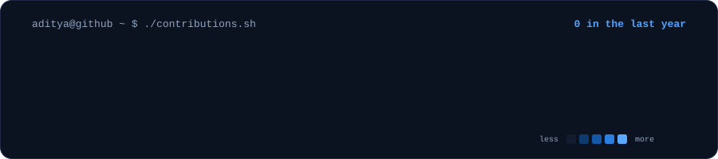
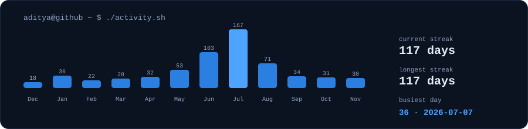
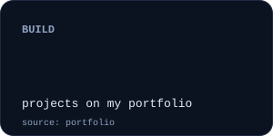

<!-- Every card is an animated SVG drawn by scripts/render_readme_cards.py and refreshed daily
     by .github/workflows/update-profile-art.yml. Design: "Three Worlds", paper, ink, and one
     colour per world: BUILD blue, SOLVE red, LEARN yellow.
     Spacing is baked into the SVGs, so keep this block free of blank lines and keep the cards in
     a row on one line with no spaces between them. -->

 
 
 
 
<picture><source media="(prefers-color-scheme: dark)" srcset="./cards/title-coding-dark.svg" /></picture> 

<a href="https://adityayashovardhan.vercel.app/">adityayashovardhan.vercel.app</a> &nbsp;/&nbsp; <a href="https://github.com/Adityya21">github</a> &nbsp;/&nbsp; <a href="https://www.linkedin.com/in/aditya-yashovardhan-859276296/">linkedin</a> &nbsp;/&nbsp; <a href="https://x.com/adityyahh">x</a> &nbsp;/&nbsp; <a href="https://leetcode.com/u/fvgKStlmkk">leetcode</a>

